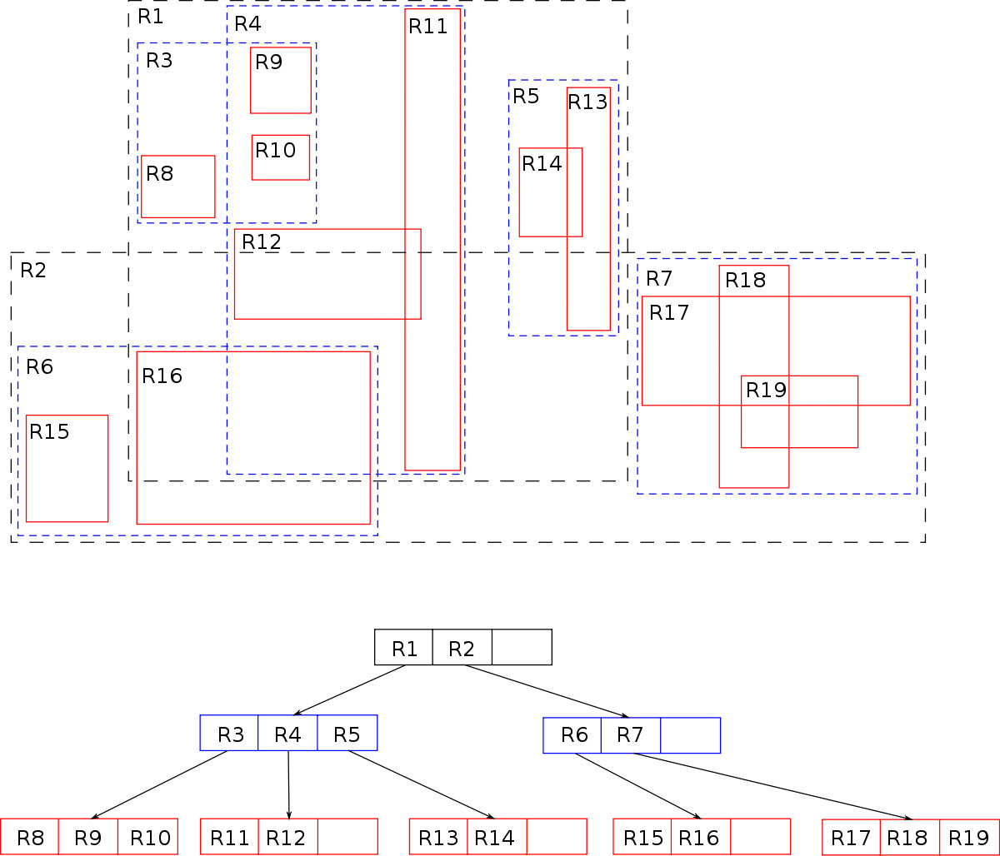

# R-tree data structure

[https://en.wikipedia.org/wiki/R-tree](https://en.wikipedia.org/wiki/R-tree)

phù hợp cho những dữ liệu phân tán theo nhiều chiều, ví dụ như tọa độ địa lý, những bài toán liên quan tới tìm hàng xóm gần nhất.

R-tree giải quyết bằng cấu trúc dữ liệu có tổ chức thành các hộp (rectangle, polygon) bao lấy các điểm dữ liệu với đặc điểm vùng bao nhỏ nhất (minimum bounding rectangle - MBR), mỗi tầng của cây sẽ bao gồm các rectangle bao lấy các rectangle nhỏ hơn.

tổ chức dữ liệu như vậy phục vụ truy vấn gần nhất, trong vùng, bán kính nhanh hơn rất nhiều, lấy ví dụ truy vấn các điểm dữ liệu nằm trong hình chữ nhật:

- truy vấn sẽ đi từ gốc là rectangle bao toàn bộ map
- với mỗi rectable nằm trong rectable trước:
  - nếu intersect với rectangle truy vấn, lặp lại bước trên
  - nếu không intersect, skip

như vậy ta đã quét được toàn bộ rectable cấp n nào đó nằm trong vùng rectable truy vấn và bỏ qua được kha khá các điểm dữ liệu khác

thuật toán có độ phức tạp trung bình O(log(n)), trong trường hợp tệ nhất thì là O(n) tức quét tất, trong thực tế tức là truy vấn toàn bộ dữ liệu (nếu thế thì không dùng R-tree), do vậy thuật toán này phù hợp cho các bài toán thực tế (đã được chứng minh).

việc build cây thì mình chưa tìm hiểu TODO.
