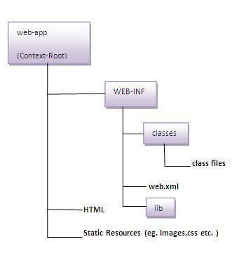

# Tomcat

note about tomcat

# Directory Structure

(cấu trúc là cấu trúc không đc đạo chế thay đổi)



## `web-app`

-   là thư mục root chứa tất cả code, resource
    tên sẽ được dùng ở url prefix của tomcat

-   ví dụ bạn để tên thư mục là tuana9a thì tất cả url sẽ được map từ /tuana9a/cái/gì/đó
    nếu đặt tên là ROOT thì url sẽ bắt đầu từ /

-   một tomcat có thể có nhiều web-app độc lập
    -   mỗi webapp là một project khác nhau được
    -   các phần con còn lại là cấu trúc của web-app

## `WEB-INF/classes`

-   chứa các class tự viết

## `WEB-INF/lib`

-   chứa thư viện đi kèm của project đó
-   VD:
    -   mysql-connector-java-8.0.19.jar
    -   javax.servlet.jar
    -   jsoup-1.11.3.jar

## `WEB-INF/web.xml`

"deployment descriptor"
web container parse this to manipulate your app

# `web.xml`

cấu trúc web.xml (ngoài ra còn rất nhiều config khác)

```xml
<web-app xmlns:xsi="http://www.w3.org/2001/XMLSchema-instance" xmlns="http://java.sun.com/xml/ns/javaee" xmlns:web="http://java.sun.com/xml/ns/javaee/web-app_3_0.xsd" xsi:schemaLocation="http://java.sun.com/xml/ns/javaee http://java.sun.com/xml/ns/javaee/web-app_3_0.xsd" id="WebApp_ID" version="3.0">
    <!-- represents the whole application. -->

    <welcome-file-list>
        <!-- danh sách file chào đón VD: home.html,...-->
        <welcome-file>/home.html</welcome-file>
    </welcome-file-list>

    <context-param>
        <param-name>driver</param-name>
        <param-value>sun.jdbc.odbc.JdbcOdbcDriver</param-value>
    </context-param>

    <servlet>
        <!-- represents the servlet -->
        <servlet-name>MainServlet</servlet-name>
        <servlet-class>com.tuana9a.servlets.MainServlet</servlet-class>
        <init-param>
            <param-name>driver</param-name>
            <param-value>sun.jdbc.odbc.JdbcOdbcDriver</param-value>
        </init-param>
        <!-- thứ tự load class vô memory lúc deploy server -->
        <!-- giá trị: 0, 1, 2, 3 trong đó 0 sẽ được load đầu tiên sau đó 1,2,3 giá trị âm thì load trong lần gọi đầu tiên -->
        <load-on-startup>0</load-on-startup>
    </servlet>

    <servlet-mapping>
        <!-- map the servlet -->

        <!-- epresents the name of the servlet
            tương ứng với servlet-name ở trên  -->
        <servlet-name>MainServlet</servlet-name>

        <!-- client-side use this to invoke the servlet là url trên broswer để gói servlet tương ứng -->
        <!-- url bắt đầu từ folder bố (folder con cấp 1 của folder webapps) -->
        <!--  VD:
            /*	tất cả  các url kể cả cấp con
            /	khi không tìm thấy 404 not found
            /*.jsp	tất cả url cấp 1 có đuối .jsp
            *.jsp	tất cả url kể cả cấp con có đuôi.jsp -->
        <!-- nếu url này bị conflict thì nó sẽ chọn cái url mà cụ thể nhất (dài nhất) -->
        <url-pattern>/api/servlets/main</url-pattern>
    </servlet-mapping>

</web-app>
```
