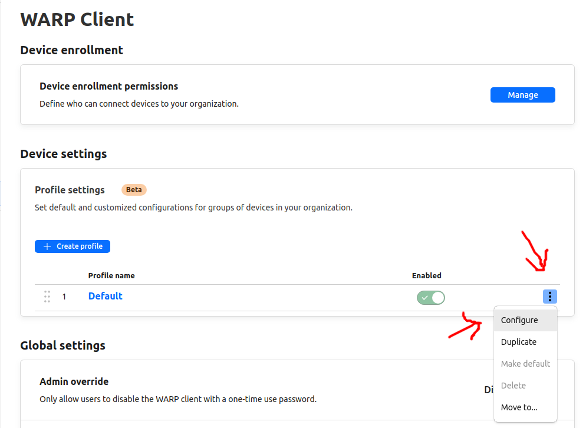
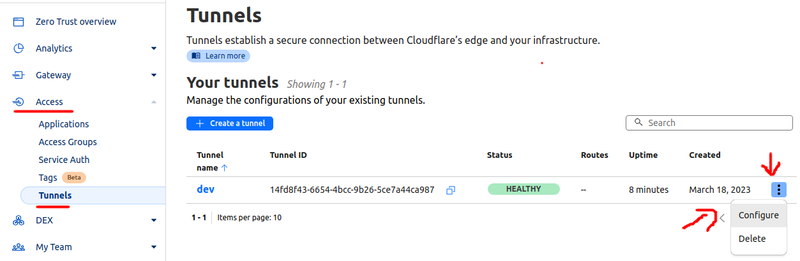

# cloudflare-tunnel or (cloudflared)

how to use cloudflare tunnel as a vpn to your infrastructure

make warp client handle the ip range of you network

**TODO** confiure

then add the ip range to the private network tab

**TODO** configure

