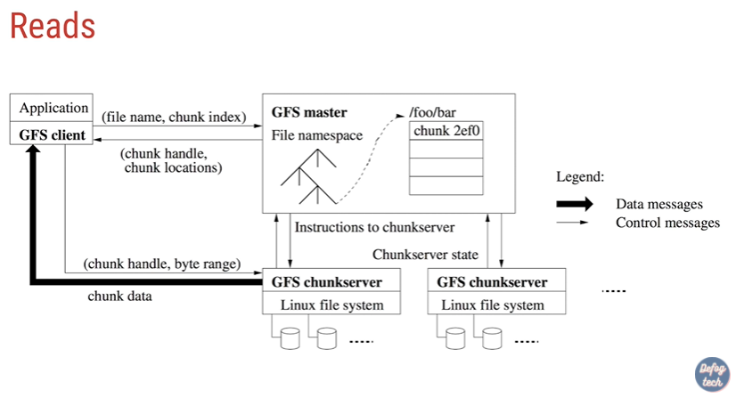

# Hadoop


## Google FS




## How to setup

### 1. `/etc/hosts`

sửa host file trên tất cả các node

### 2. `/home/$USER/.ssh/authorized_keys`

add public keys của toàn bộ node đôi một

### 3. `/home/$USER/.bashrc`

```bash
# remember to export java home
export JAVA_HOME=/path/to/jdk
export PATH=$PATH:$JAVA_HOME/bin

# @tuana9a add hadoop path
export HADOOP_HOME=/opt/hadoop-3.2.2
export PATH=$PATH:$HADOOP_HOME/bin:$HADOOP_HOME/sbin

# @tuana9a add spark path
export SPARK_HOME=/opt/spark-3.1.1-bin-hadoop3.2
export PATH=$PATH:$SPARK_HOME/bin:$SPARK_HOME/sbin
```

### Lưu ý

- phải đảm bảo rằng các node có thể connect lẫn nhau mà **KHÔNG** cần nhập password (password less)

- trường hợp dùng máy host làm master, các slave được cài trên máy ảo và network mode là NAT
  - network này không cho phép slave có thể kết nối tới master
  - do vậy cần chuyển network mode sang host-only hoặc loại network khác

## Other resource on [Goggle Drive](https://drive.google.com/drive/folders/1jy3jGJnp2PGHNBkZJRpMD2jC4sze8nKl?usp=sharing)
