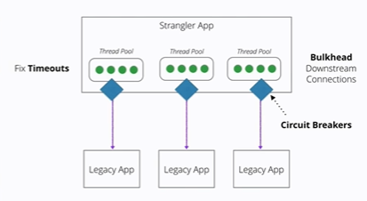
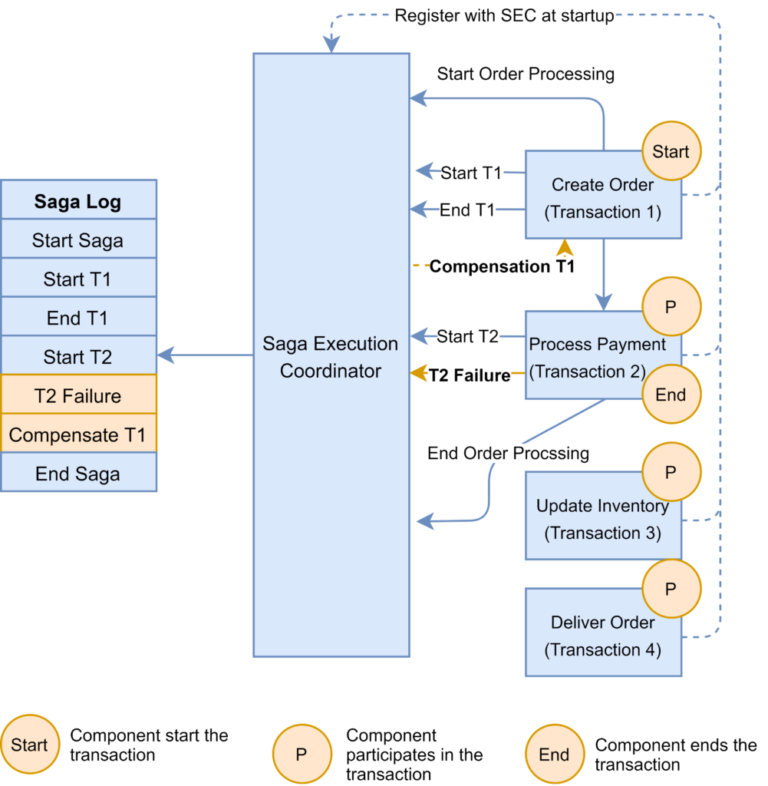

# Microservice

[Google Drive](https://drive.google.com/file/d/1EiCn4PK4_GIXYVbBfHeIeyJfKs3NwYtR/view?usp=sharing)

## Approaches

- Have n microservices share a single database
- Give each microservice its own database with no shared data
- Split the database into multiple read and a single write database
- Shard the data onto multiple databases each one having only part of the data

## When having spike connections, requests or to avoid **cascading failures**

### circuit breaker

### Debug

#### correlation-id

## Consistency

### week consistency

### **eventually consistency**

- là một dạng của weak consistency

- không đảm bảo tại 1 thời điểm mọi node trả về kết quả mới nhất, tuy nhiên sau đó một vài thời gian kết quả trả về sẽ là mới nhất

### strong consistency

đảm bảo đọc, ghi dữ liệu trên mọi node luôn là mới nhất

### distributed lock

[README.md](../distributed-lock/README.md)

### two phase commit

steps:

- ask every one to prepare transation

  - wait until every one is ready
  - even if there is only one left

- if every one is read then execute transaction

  - wait until every one is complete
  - if one fail every one wait
    - this one if then reconnect to cordinator
            then it must do the uncommit jobs
            then send to the cordinator
  - if one send failed
    - every one else rollback

nhận xét

- blocking là điểm trừ đầu tiên, cần prevent dead lock
- cordinator service is the bottle neck
  - ngoài ra còn là single point of failure
- và một service phải làm nhiều việc hơn các service khác
  - không đúng lắm với tính chất của microservice khi
  - một service chỉ là một nhiệm vụ và làm tốt nhiệm vụ đó

- nhìn chung cái này cảm giác phù hợp cho ngân hàng
    khi tốc độ không phải ưu tiên mà tính toàn vẹn dữ liệu được đặt lên hàng đầu

### SAGA

[https://www.baeldung.com/cs/saga-pattern-microservices](https://www.baeldung.com/cs/saga-pattern-microservices)

các điều kiện cho saga:

- một transaction phải thỏa mãn điều kiện
  - luôn tồn tại một revert transaction tương ứng
  - có khả năng retryable (tương tự cái trên)

pattern này được sử dụng phù hợp với hệ thống dạng như sau

VD: create order -> process payment -> update inventory -> deliver order

các service trong 1 transaction được gọi tuần tự và theo đúng flow

implementation

- coordinator
  - condinator khi có yêu cầu sẽ lấy kịch bản (flow) đã được định nghĩa trước
  - sau đó gọi lần lượt các service trong bảng và thực thi tuần tự
        
  - khi failed
        
- orchestation
  - mỗi service sẽ được quản lý bởi 1 coordinator riêng
        

cái này phải code chứ không đc auto trong database

## CQS Command Query Separation

often metion with DDD and Event Sourcing

- command
  - change object internal state then
  - return nothing or meta-data only
- query
  - return infomation but
  - **doesn't** change internal state

A method should never be both simultaneously

Examples:

- Stack.push: command
- Stack.top: query
- Stack.pop: **violate** pattern

Can separate databases for reading and writing

But a client does not find out whether a command has already been processed and what the result was
Therefore, it is recommended to use a third API, **the Events API**, which informs about events via **push notifications** via web sockets, HTTP streaming, or a similar mechanism.

So instead of returning result immediately, it return result later by pushing those data to client

It's **Interesting**

## Refs

[https://levelup.gitconnected.com/what-is-cqrs-8ddd74ca05bb](https://levelup.gitconnected.com/what-is-cqrs-8ddd74ca05bb)

## Tips

- rollback"able" devops

## Keywords

- `SAGA`
- `Two Phase Commit`
- `Raft Consensus Algorithm`
- `Distributed Lock`
- `Distributed Transaction`
- `Circuit Breaker`
- `Correlation Id`
- `Week Consistency`
- `Strong Consistency`
