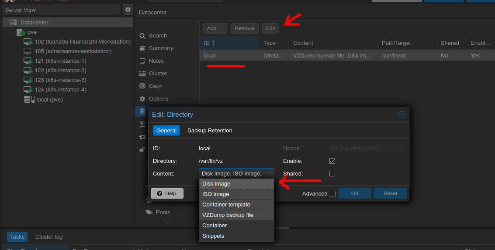

# proxmox

## increase default root storage for storing virtual machines

first remove `local-lvm` via the web-ui.


open the proxmox server shell then type these commands to take 100% disk size.

```bash
lvremove /dev/pve/data
```

```bash
lvresize -l +100%FREE /dev/pve/root
```

```bash
resize2fs /dev/mapper/pve-root
```

then allow disk image for storage



## proxmox resize disk for ubuntu server 18.04

on proxmox host

[https://pve.proxmox.com/wiki/Resize_disks](https://pve.proxmox.com/wiki/Resize_disks)

```bash
qm resize <vmid> <disk> <size>
```

```bash
qm resize 102 scsi0 +80G
```

on virtual machines

[Ubuntu: Extend your default LVM space](https://packetpushers.net/ubuntu-extend-your-default-lvm-space/)

[Ask Ubuntu - Ubuntu Server 18.04 LVM out of space with improper default partitioning](https://askubuntu.com/questions/1106795/ubuntu-server-18-04-lvm-out-of-space-with-improper-default-partitioning)

**NOTE** `cfdisk` step is only needed when you see disk size doens't increase after your resize it on the web ui.

```bash
cfdisk
```

Select `/dev/sda3` (disk you want to resize)

Select `Resize`, Hit `Enter`

Hit `Write`, type `yes`, hit `Enter`

Hit `q` to quit

```bash
pvdisplay
```

```bash
vgdisplay
```

```bash
lvdisplay
```

```bash
sudo lvextend -l +100%FREE /dev/ubuntu-vg/ubuntu-lv
```

```bash
sudo resize2fs /dev/mapper/ubuntu--vg-ubuntu--lv
```

### refs

## how to add NAT network to proxmox

open the proxmox server shell.

edit /etc/network/interfaces

```bash
vim /etc/network/interfaces
```

add these line, edit if necessary 😊.

**IMPORTANT**: interface name must start with `vmbr`, ex: `vmbr1`, `vmbr2`

```bash
auto vmbr2
iface vmbr2 inet static
        address  192.168.1.1
        netmask  255.255.255.0
        bridge_ports none
        bridge_stp off
        bridge_fd 0

post-up echo 1 > /proc/sys/net/ipv4/ip_forward

post-up   iptables -t nat -A POSTROUTING -s '192.168.1.0/24' -o vmbr0 -j MASQUERADE
post-down iptables -t nat -D POSTROUTING -s '192.168.1.0/24' -o vmbr0 -j MASQUERADE
```

vmbr0 is another interface that will be used to access outside network (NAT)

```bash
ifup vmbr2
```

```bash
ifreload -a # just to make sure
```

## how to import from virtual box

[https://credibledev.com/import-virtualbox-and-virt-manager-vms-to-proxmox/#import-virtualbox-vm-to-proxmox](https://credibledev.com/import-virtualbox-and-virt-manager-vms-to-proxmox/#import-virtualbox-vm-to-proxmox)

export virtualbox to `.ova` file

```bash
tar -xvf your-vm.ova
```

create a blank vm on promox (no disk)

```bash
qm importdisk <vmid> your-vm-disk001.vmdk <storage_name> -format qcow2
```

ex:

```bash
qm importdisk 121 k8s-instance-1-disk001.vmdk local -format qcow2
```

then just enable (Add) the disk in proxmox web ui.
