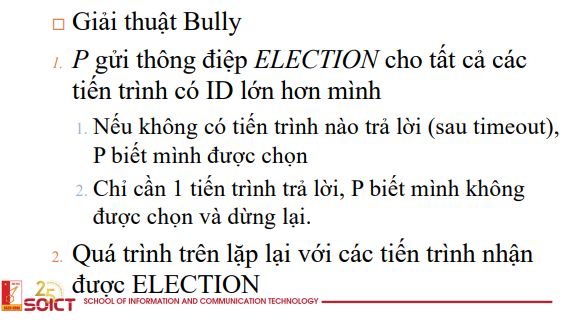
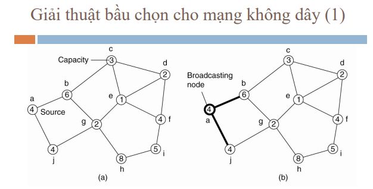
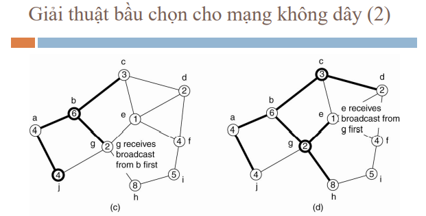

# các thuật toán bầu chọn

để giải quyết bài toán về đồng bộ  
người ta cũng có cơ chế bầu chọn  
để tìm ra được một node master, một node duy nhất thực thi công việc nào đó

công việc này có thể là sử dụng tài nguyên, orchestation, promoting, ...

thuật toán này rất đơn giản (truyền thống)  
để ứng dụng chắc chắn sẽ phải mở rộng và chỉnh sửa

các giải thuật gồm

-   giải thuật truyền thống
    -   giải thuật bully
    -   giải thuật ring
-   giải thuật mạng không dây (diện rộng)

# giải thuật bully

đại loại bầu chọn theo một chỉ số nào đó (priority)

các node sẽ gửi yêu cầu sử dụng (broadcast) cho toàn bộ các node khác, 
thấp hơn thì skip, cao hơn thì phải rep

node cao hơn sẽ gửi tiếp các request tới các node cao hơn  
các node chỉ thắng thì mọi node khác không trả lời (xử lý được cả node die)

nhận xét: cái này khá tự nhiên (hay) nhưng cũng có một vài vấn đề

-   mất request
-   request delay
-   network partition

# giải thuật ring

cái này tôi quên cm nó rồi đại loại giống ring ở trên và chuyền tay nhau

# giải thuật bầu chọn cho mạng không dây

giờ nếu các node không biết vị trí của nhau mà chỉ biết node gần nó

chính là mạng mấy tính diện rộng, mạng wifi

ở giải pháp đầu tiên này thì sẽ lan truyền dần cho tới nút lá, 
sau đó sẽ lan truyền ngược lại

