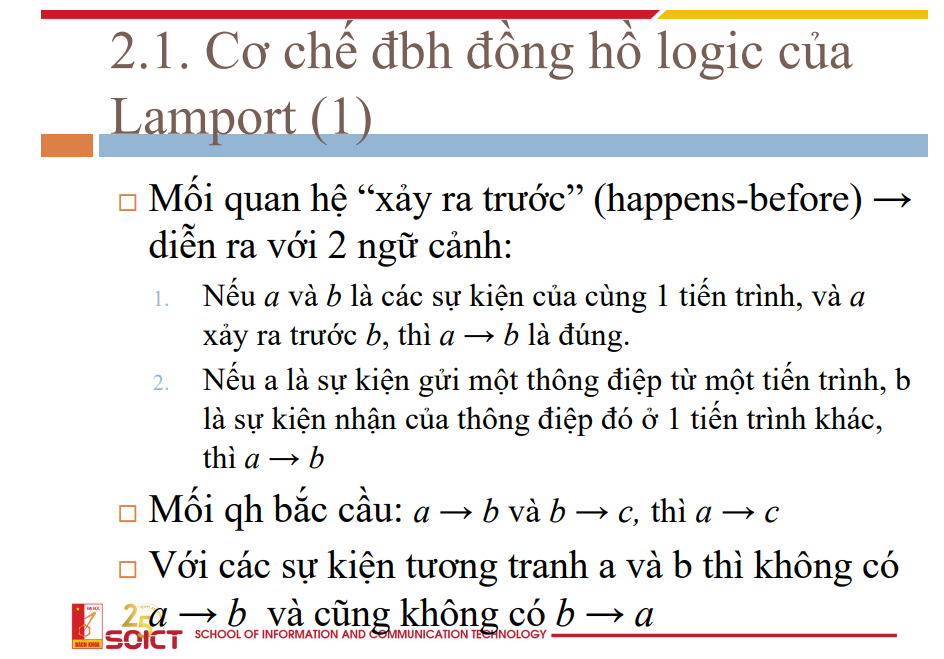
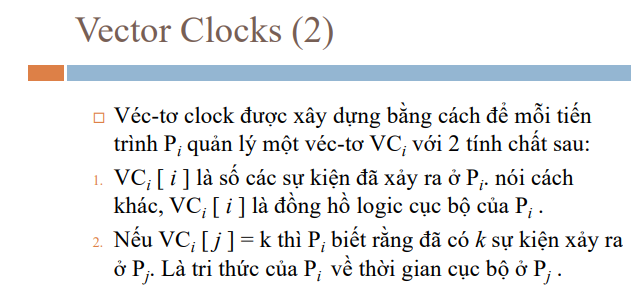

# đồng bộ hoá đồng hồ logic

# bài toán

nhận xét nếu một hệ thống không cần quá chính xác về thời gian  
chỉ cần chúng hoạt động đúng logic thì có thể xem xét các thuật toán sau

-   đồng bộ hoá đồng hồ logic của lamport
-   vector clocks

## cơ chế đồng bộ đồng hồ logic của lamport

lamport sẽ giải quyết bài toán về vấn đề cycle (chu kì)  
của các clock trên các đồng hồ là khác nhau  
hay tổng quát là lệch thời gian

có thể thấy với ảnh dưới thì rõ ràng thông điệp gửi đi ở node này  
lại được node kia nhận ở thời gian trước đó

**(vô lý)**

vậy để làm cái đồng hồ hết vô lý thì làm như thế nào, 
cùng xem thuật toán tự điều chỉnh đồng hồ của lamport xem sao

bằng cách cập nhật, tự điều chỉnh thời gian theo thông tin của gói tin nhận được, 
các node có thể đảm bảo đồng hồ của mình chạy **phù hợp** với node gửi

## lưu ý

-   đây chưa liên quan gì tới xử lí mà chỉ đơn giản là điều chỉnh đồng hồ cho phù hợp
-   về mặt thứ tự ở đây đã có sự được đảm bảo, gói tin sẽ được sử lí chỉ khi sau thời gian gửi + 1
-   để áp dụng vào thực tế trong môi trường song song, đa luồng thì cần implement một cách phức tạp hơn

## vector clock

dựa vào ý tưởng đảm bảo thứ tự ở trên ta có thể triển khai advance hơn 
trên mạng phân tán

để đảm bảo thứ tự thực hiện như trên

bài toán ở trong hệ phân tán là ai sẽ là người được đi vào trước, 
trong khi ai cũng có thể đi vào

và nếu "dễ dãi" chấp nhận cả 2 thì khi đồng bộ sẽ có tranh chấp về dữ liệu

VD: con rút tiền, mẹ gửi tiền

bằng cách sử dụng một biến đếm số lượng các task đã thực thi 
nhằm chính xác thứ tự thực hiện  
và chỉ thực hiện khi điều kiện đáp ứng

sau đó mỗi khi sự kiện này sảy ra sẽ thêm vào biến đếm 
từ đó khi được truyền đi bên nhận sẽ biết được thứ tự nên thực hiện

phía dưới là một ví dụ việc đảm bảo thứ tự, 
node nhận gói tin chỉ thực thi khi đáp ứng điều kiện bên gửi

**EM CÓ CÂU HỎI**

